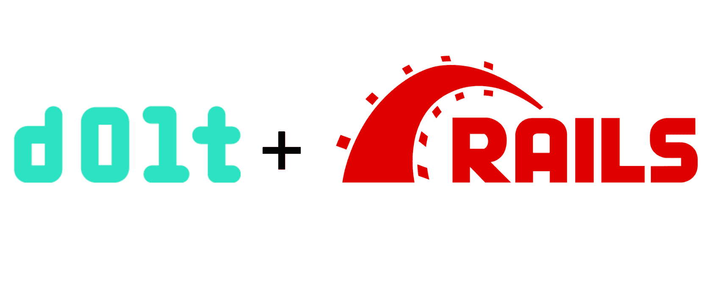

This is the weekly CEO update from [DoltHub](https://www.dolthub.com/). I'm Tim, the CEO of DoltHub. 

This is your last cheesy joke for a couple weeks. I'm heading out to the mother country on my annual ski trip next week. I know you'll miss the Dolt updates but you'll especially miss the joke.

### Dolt + Rails

We're on a mission to show that Dolt just works with all your favorite tools in all your favorite languages. This week, [the spotlight](https://www.dolthub.com/blog/2024-02-09-dolt-ruby-on-rails/) is on [Ruby On Rails](https://rubyonrails.org/), a popular Ruby-based website builder with a built-in ORM. 

We've covered how other website builders work with Dolt recently including [Laravel](https://www.dolthub.com/blog/2024-01-08-dolt-laravel/) and [Django](https://www.dolthub.com/blog/2024-01-31-dolt-django/). If you have any others, you'd like to see, just reply to this email. They are fun blogs for me to write because I get to write some sample code.

### Upgrading Your Hosted Instance

[Hosted Dolt](https://hosted.doltdb.com) got some upgrades recently. You can now add and remove replicas from your deployment, upgrade the size of your primary instance, and restart a stopped deployment from a backup. Hosted Dolt is the easiest way to run Dolt in production. Get started with a trial instance for $50/month.

### Doltgres Types

Slowly but surely, we are making progress on Doltgres. The focus right now is type support and replication. Doltgres won't be ready to be your primary for another few months but it can serve as a [version controlled replica](https://docs.dolthub.com/introduction/getting-started/versioned-mysql-replica). A couple potential customers have expressed interest in running it as a replica to get an audit log of every cell and powerful rollback capabilities. [Zach](https://www.dolthub.com/team#zach) is working on that and will have an announcement in the next couple weeks. 

Meanwhile, [Daylon](https://www.dolthub.com/team#daylon) is laying the groundwork to support types that are not supported by MySQL. You can't replicate types we don't support! He [blogs about that journey](https://www.dolthub.com/blog/2024-02-14-adding-types-to-doltgresql/) this week.

Talk to you again in two weeks. As always, just reply to this email if you want to chat.

--Tim