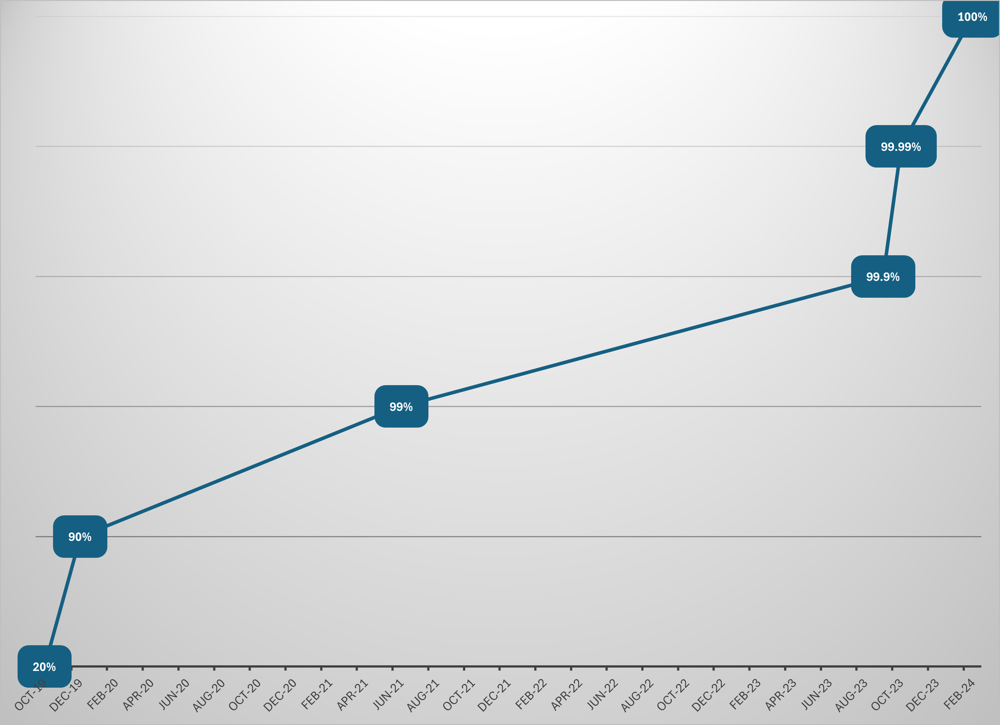

This is the weekly CEO update from [DoltHub](https://www.dolthub.com/). I'm Tim, the CEO of DoltHub. 

In lieu of a joke, I have an invitation to meet me and the team in person. We will be at this year's Game Developer Conference Expo taking place at the Moscone Center in San Francisco from 3/18-3/22. Come visit us in the start-up area of the Exhibit Hall, booth SU19. We have some exciting demos to share.

### 100% `sqllogictest` Correctness

We're pleased to announce that we reached [100% correctness against the `sqllogictest` suite](https://docs.dolthub.com/sql-reference/benchmarks/correctness) of 5.9M SQL queries. We started at 20% correctness, quickly got to 90% correctness, and then slowly worked our way through the 9s all the way to 100%. The last three months we got so close that we pushed for 100%.

Of course, Dolt is not 100% MySQL compatible, but it almost is. We're starting to report other correctness metrics like [SQL function coverage](https://docs.dolthub.com/sql-reference/benchmarks/correctness#function-coverage), 60%, and [engine test success rate](https://docs.dolthub.com/sql-reference/benchmarks/correctness#skipped-engine-tests), 99.6%. Engine tests are our own suite of ~41,500 hand-generated tests. When we find an edge-case query where we don't return the same results as MySQL we create a skipped engine test for it. We currently have 166 skipped tests.

Remember, we can usually fix compatibility bugs in under 24 hours, so if you find one, please create a [GitHub issue](https://github.com/dolthub/dolt/issues). We take pride in this 24 hour turnaround time.

### ASP.NET Core Works with Dolt

We're on a mission to show that Dolt just works with all your favorite tools in all your favorite languages. This week, [the spotlight](https://www.dolthub.com/blog/2024-02-28-works-with-dolt-dotnet-webapp/) is on [.NET](https://dotnet.microsoft.com/en-us/), one of the core frameworks in Microsoft's ecosystem. 

The blog comes with [sample code](https://github.com/dolthub/dolt-dotnet-webapp-sample) you can run on your own machine. You can play with a movie catalog building application complete with branches, diff, and merges.

### Shallow Clone Support

Databases are big and even bigger if you include all the history. What is you only want to clone the latest? In Git, there is a concept called [shallow clone](https://git-scm.com/docs/git-clone#Documentation/git-clone.txt---depthltdepthgt) and there was a [long standing feature request for Dolt to support it](https://github.com/dolthub/dolt/issues/3403). 

Well, you can now [shallow clone in Dolt](https://www.dolthub.com/blog/2024-02-21-shallow-clone/). It still is often better to just clone the entire Dolt database if you can spare the disk space. As they say, [results may vary](https://www.dolthub.com/blog/2024-02-21-shallow-clone/#results).

Until next week. As always, just reply to this email if you want to chat.

--Tim