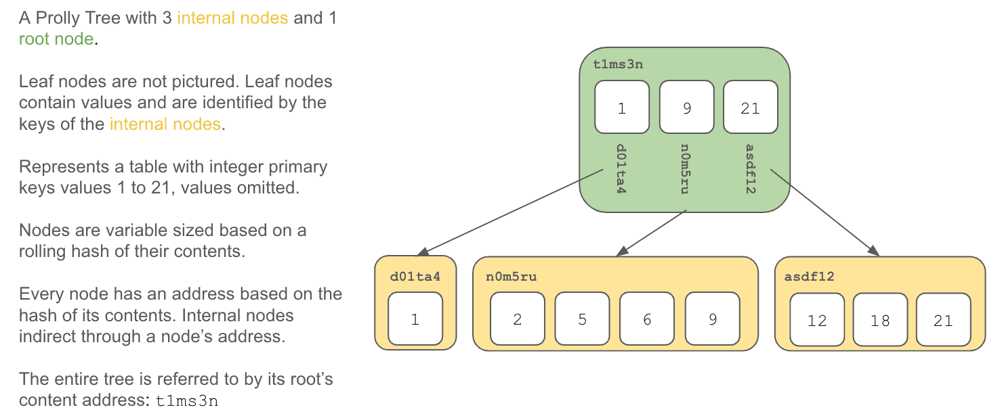

This is the weekly CEO update from [DoltHub](https://www.dolthub.com/). I'm Tim, the CEO of DoltHub. 

You're prolly going to get a joke this week. Prolly is short for probabilistic but many people like to think it's short for probably and [make jokes on social](https://www.reddit.com/r/computerscience/comments/1b34x0k/comment/ksy38zg/?context=3) when I post about Prolly Trees. Now's your chance! Reply with your favorite prolly jokes and I'll post the best one next week.

### Dolt + Flock Safety

[Flock Safety](https://www.flocksafety.com/) uses [Dolt as their ML Feature Store](https://www.dolthub.com/blog/2024-03-07-dolt-flock/).

Flock Safety is a very cool company. They install infrastructure-less cameras in neighborhoods, stream data back to their servers, and run ML on the data to help detect and prevent crime. A recent [study](https://www.researchgate.net/publication/377845222_Flock_Safety_Technologies_in_Law_Enforcement_An_Initial_Evaluation_of_Effectiveness_in_Aiding_Police_in_Real-World_Crime_Clearance) showed they helped solve 10% of reported crime in the US! We're very excited to help them on this mission.

### How Dolt Works Series

I published a series of blog posts on how Dolt works. I start with an overview of Dolt's [storage engine](https://www.dolthub.com/blog/2024-02-29-storage-engine/). Then, I deep dive into the core data structure used in the storage engine, the Probabilistic B-Tree, or [Prolly Tree](https://www.dolthub.com/blog/2024-03-03-prolly-trees/) for short. Finally, I finish up with how a [commit graph](https://www.dolthub.com/blog/2024-03-05-commit-graph/) of Prolly Tree roots is used to facilitate Git-style version control. 

These blogs were fun to write and are full of pictures like the one below. If you want to know how Dolt works, please dive in.

### TPC-C Update

As many of you know, we like to tell folks Dolt is about 2X slower than MySQL. This is based on the [`sysbench`](https://en.wikipedia.org/wiki/Sysbench) standard database benchmark. We [publish how Dolt compares to MySQL on `sysbench`](https://docs.dolthub.com/sql-reference/benchmarks/latency) every Dolt release. `sysbench` isn't the only database benchmark out there. There's also the [TPC series of benchmarks](https://www.tpc.org/information/benchmarks5.asp). The most commonly used benchmark for OLTP databases like Dolt is [TPC-C](https://www.tpc.org/tpcc/default5.asp). 

We started measuring Dolt using TPC-C [way back in 2021](https://www.dolthub.com/blog/2021-10-25-dolt-vs-mysql-tpc-benchmark/). At that point, Dolt was 71X slower than MySQL. In late 2022, with the new format, [we measured again](https://www.dolthub.com/blog/2022-09-16-tpcc-update/) and Dolt was 9X slower than MySQL. We've made a bunch of optimizations over the year including [better name resolution](https://www.dolthub.com/blog/2023-09-06-three-9s-correctness/) and [table statistics](https://www.dolthub.com/blog/2024-01-22-join-statistics/) and now [we can report we are 4.5X slower than MySQL](https://www.dolthub.com/blog/2024-03-06-tpcc-update-2/) on TPC-C. The goal is to get under 3X in the next few months.

Until next week. As always, just reply to this email if you want to chat.

--Tim