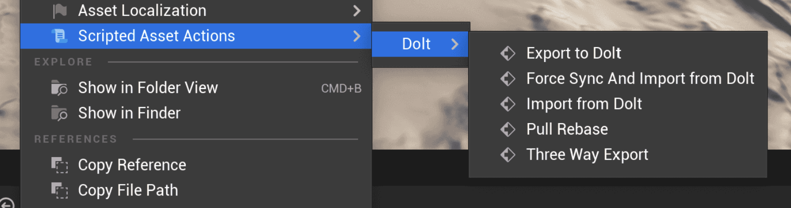

This is the weekly CEO update from [DoltHub](https://www.dolthub.com/). I'm Tim, the CEO of DoltHub. 

Last week I asked for your best prolly jokes. Well, the moral of the story is I prolly shouldn't have asked. No jokes received. Prolly no one is reading this.

### Postgres Replication to Doltgres

We continue to invest in a Postgres-flavored version of Dolt called [Doltgres](https://github.com/dolthub/doltgresql). One of the first features you all have asked for is the ability to replicate your deployed Postgres to Doltgres. We have [this feature for Dolt](https://docs.dolthub.com/introduction/getting-started/versioned-mysql-replica) and we always thought it was a great way to onboard Dolt into your environment with very little risk. You get Dolt logs and diffs on a replica without Dolt being your production database. Dolt becomes "database insurance" against a bad operator query or a bug in your production software. All upside, no downside. 

So, [Zach](https://www.dolthub.com/team#zach) has been implementing Postgres logical replication in Doltgres and he wrote [a very helpful guide](https://www.dolthub.com/blog/2024-03-08-postgres-logical-replication/) on how to do that. Stay tuned in the coming weeks for the Doltgres replication launch announcement.

### Dolt + Unreal Editor

Did I mention, we are going to be a GDC next week in San Francisco? Stop by the start up section of the hall to find our booth.

In preparation, we wanted to have a couple game specific demos to show. The first is [how to use Dolt with Unreal Editor](https://www.dolthub.com/blog/2024-03-11-dolt-plus-unreal/). [Nick](https://www.dolthub.com/team#) built an [Unreal editor plug in](https://github.com/dolthub/unreal-dolt) that uses Dolt to three-way merge Unreal data tables. 

### Toxiproxy

[Jason](https://www.dolthub.com/team#jason) wrote the latest in [our Golang blog series](https://www.dolthub.com/blog/?q=golang). This time he demonstrates [how to use Toxiproxy](https://www.dolthub.com/blog/2024-03-13-golang-toxiproxy/) to test your Golang applications network resiliency.

Until next week. As always, just reply to this email if you want to chat.

--Tim