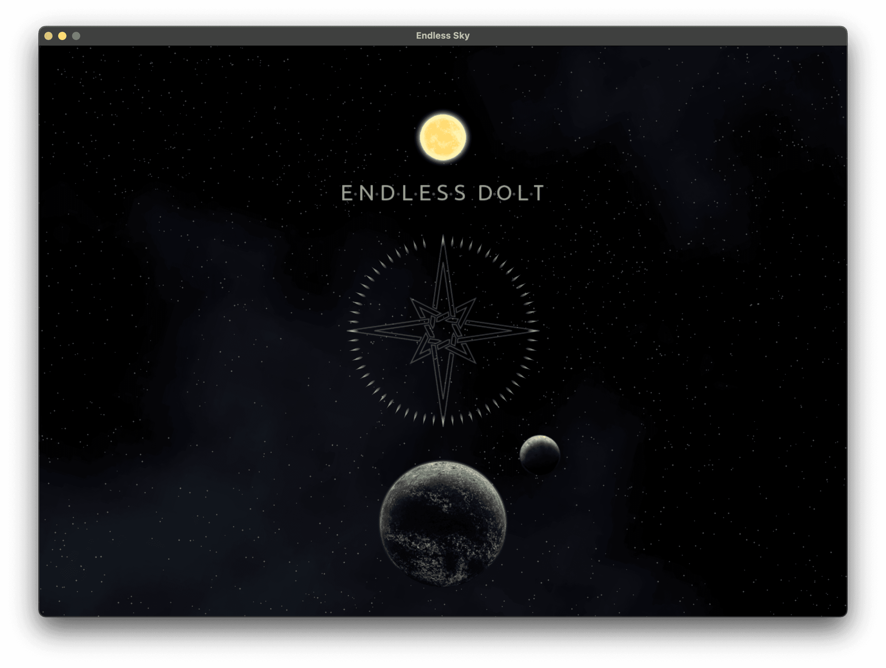

This is the weekly CEO update from [DoltHub](https://www.dolthub.com/). I'm Tim, the CEO of DoltHub. 

Thanks to everyone who stopped by our booth at GDC. We only had one person challenge us to "fight me in real life". It was over Parquet. We declined given that it was *actually* real life already.

### Dolt for Game Development

In celebration of our attendance at GDC, we ported the game configuration for the open source game [Endless Sky](https://endless-sky.github.io/) to Dolt to show off how our customers [use Dolt to version game configuration](https://www.dolthub.com/blog/2024-03-18-dolt-for-gamedev/). You can check out [the database on DoltHub](https://www.dolthub.com/repositories/dolthub/endless-sky) to get some inspiration on how your game configuration could look in Dolt.

The main idea is if you put your game configuration in Dolt instead of files in Git, you get:

1. The branch, merge, and pull request workflow you know and love.
-AND-
2. The full power of SQL to find and update the right configuration for your game.

### Dynamic Styling of a React Library

We love our database user interface. We love it so much we ship it with four products: [DoltHub](https://www.dolthub.com), [DoltLab](https://www.doltlab.com), [Hosted Dolt](https://hosted.doltdb.com), and the new [Dolt Workbench](https://github.com/dolthub/dolt-workbench). Each time we shipped it with a new product we forked the code and it was becoming unwieldy to maintain. 

So, [Taylor](https://www.dolthub.com/team#taylor) has been hard at work factoring out the common components. One of the main challenges is making sure everything is the right color. She shares what she learned about how to use [Dynamic Tailwind Themes in a React Library](https://www.dolthub.com/blog/2024-03-20-dynamic-tailwind-themes/).

We're generally known for our Golang blogs, but we love web developers too.

### GORM works with Dolt

We're on a mission to show that Dolt just works with all your favorite tools in all your favorite languages. This week, [the spotlight](https://www.dolthub.com/blog/2024-03-15-gorm-with-dolt/) stays in our native tongue, Golang, where we show off how Dolt works with [GORM](https://gorm.io/index.html), the most popular Object Relational Mapper (ORM) in Go.

The [blog](https://www.dolthub.com/blog/2024-03-15-gorm-with-dolt/) comes complete with a [sample application](https://github.com/dolthub/gorm-demo) that does some cool operations on our [open love letters database](https://www.dolthub.com/repositories/max-hoffman/letters).

Until next week. As always, just reply to this email if you want to chat.

--Tim