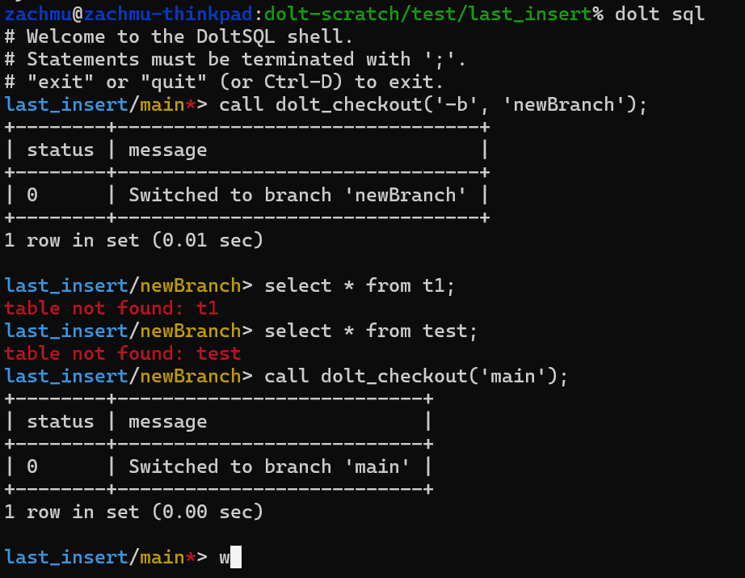

This is the weekly CEO update from [DoltHub](https://www.dolthub.com/). I'm Tim, the CEO of DoltHub. 

I've been sitting here for 30 minutes trying to think of something funny to tell you all. That's it. I've passed my joke time quota. I'm calling it on time served. No joke this week.  

### Dolt Annual Update

For those of you that don't pay much attention to these weekly updates but want [a high level overview](https://www.dolthub.com/blog/2024-04-03-state-of-dolt/) on how good Dolt has become and where we're taking it next, I have [an article](https://www.dolthub.com/blog/2024-04-03-state-of-dolt/) for you! Named after the annual State of the Union address, in [State of Dolt](https://www.dolthub.com/blog/2024-04-03-state-of-dolt/) I discuss Dolt stability, correctness, performance, and features highlighting gaps and our plans to close them. Just imagine me standing behind a podium as you read it.

### Doltgres Prepared Statements

[Zach](https://www.dolthub.com/team#zach) dives into the nitty-gritty details of [how Postgres prepared statements work](https://www.dolthub.com/blog/2024-04-01-prepared-statements-postgres/). He wrestled with this complexity implementing prepared statements in [Doltgres](https://github.com/dolthub/doltgresql), our Postgres-flavored Dolt. 

We continue to invest heavily in Doltgres and we're looking for Alpha use cases. If you have one, please respond to this email.

### Building an Interactive Shell in Golang

[Zach](https://www.dolthub.com/team#zach) also wrote the latest in [our Golang blog series](https://www.dolthub.com/blog/?q=golang). This time he demonstrates [how to build an interactive shell in Golang](https://www.dolthub.com/blog/2023-03-29-interactive-shell-golang/). As you may know, Dolt ships with a built-in SQL shell.

Until next week. As always, just reply to this email if you want to chat.

--Tim