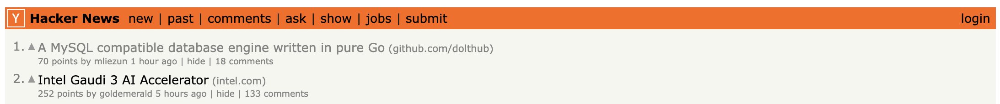

This is the weekly CEO update from [DoltHub](https://www.dolthub.com/). I'm Tim, the CEO of DoltHub. 

It's time to break out the HackerNews meme! 

[`go-mysql-server`](https://github.com/dolthub/go-mysql-server), the library we use to add MySQL-flavored SQL to Dolt, randomly went to #1 this week. The interest that drives is always fun.

### `last_insert_uuid()`

For Dolt databases, we recommend using [`UUID` primary keys instead of `AUTO_INCREMENT` primary keys](https://www.dolthub.com/blog/2023-10-27-uuid-keys/). One convenience function for `AUTO_INCREMENT` primary keys is `last_insert_id()` which returns the last assigned `AUTO_INCREMENT` integer. A customer heard us on `UUID` keys and wanted the equivalent function to get the last assigned `UUID`. We [listened and delivered](https://www.dolthub.com/blog/2024-04-10-last_insert_uuid/). 

### Doltgres SQL Support

One of our big investments in 2024 is [Doltgres](https://github.com/dolthub/doltgresql), a Postgres-flavored Dolt. We're still in the early stages of development for Doltgres. If you are a potential early adopter, please respond to this email and we'll prioritize your use case.

One of the most useful pieces of documentation at this stage is [a catalog of supported SQL](https://www.dolthub.com/blog/2024-04-09-cataloguing-sql-support-in-doltgresql/). [Jennifer](https://www.dolthub.com/team#jennifer) built one this week and boy are there are lot of red Xs. We're on it! Just like [we did for Dolt](https://docs.dolthub.com/sql-reference/sql-support), we look forward to turning those all to green checks.

### MediaWiki Works with Dolt

We're on a mission to show that Dolt just works with all your favorite tools in all your favorite languages. This week, [the spotlight](https://www.dolthub.com/blog/2024-04-05-dolt-mediawiki-wikipedia/) is on [MediaWiki](https://www.mediawiki.org/wiki/MediaWiki) and [Wikipedia](https://www.wikipedia.org/). 

Dolt can back you MediaWiki instance and even enable some decentralized collaboration use cases. I'm still chugging along with [my Wikipedia import](https://www.dolthub.com/repositories/timsehn/media_wiki/commits/main), currently at about 1.7M out of 6.7M pages. At this rate it will be done in May sometime. Worth it. It's a cool database to have on DoltHub.

Until next week. As always, just reply to this email if you want to chat.

--Tim