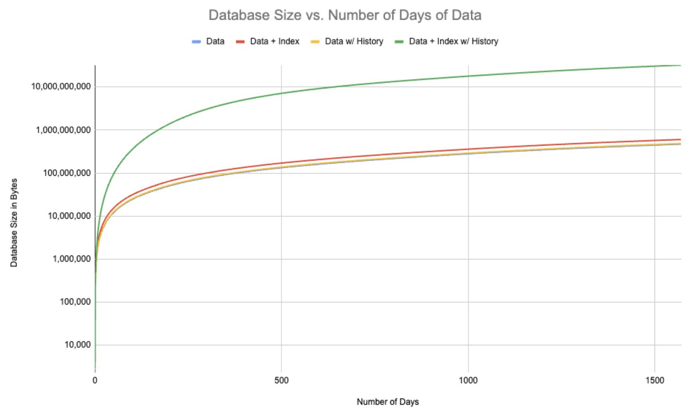

This is the weekly CEO update from [DoltHub](https://www.dolthub.com/). I'm Tim, the CEO of DoltHub. 

Tomorrow is 4/20, a holiday for some. Way back in 2020, we published [a blog](https://www.dolthub.com/blog/2020-04-20-cannabis-data-sets/) and [some databases](https://www.dolthub.com/repositories/dolthub/cannabis-testing-wa) to celebrate.

### Storing Index History

We published a couple cool technical blogs this week. The first is by [Aaron](https://www.dolthub.com/team#aaron) who infrequently writes but when he does they are worth the read. 

A couple months back we had a user try and add a useful index to the popular [stocks database](https://www.dolthub.com/repositories/post-no-preference/stocks). The publisher was surprised when the currently manageable ~2GB database started growing every day. Because of the way the index and data is structured, storing the history of the index results in little shared storage across versions. [Aaron's blog dives into great detail](https://www.dolthub.com/blog/2024-04-12-study-in-structural-sharing/) and if you're curious how Dolt works under the hood, this is a good one to read.

### The Dolt Block Store

A month or so ago, I wrote a technical trilogy of blogs on Dolt's storage engine: [Storage Engine](https://www.dolthub.com/blog/2024-02-29-storage-engine/), [Prolly Trees](https://www.dolthub.com/blog/2024-03-03-prolly-trees/), and [Commit Graph](https://www.dolthub.com/blog/2024-03-05-commit-graph/). In the Prolly Tree blog, I talked about how a content-addressed block store allows for structural sharing across versions. This week, [Neil](https://www.dolthub.com/team#neil) followed up that trilogy with a blog about Dolt's [content-addressed block store](https://www.dolthub.com/blog/2024-04-17-dolt-storage-review/) and how it works. We're making some changes to it so stay tuned for some further interesting updates!

### Schema Migrations in Dolt

We get a lot of questions about how to handle schema migrations with Dolt. Because Dolt versions both schema and data, different branches can have different schema. In some use cases this can cause problems. What's the best way to manage schema migrations in Dolt? [This blog]() explains some approaches and makes a recommendation.

Until next week. As always, just reply to this email if you want to chat.

--Tim