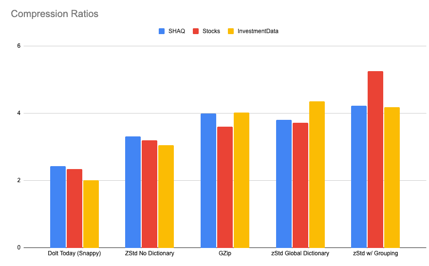

This is the weekly CEO update from [DoltHub](https://www.dolthub.com/). I'm Tim, the CEO of DoltHub. 

I've been real sick this week but that's not going to stop me from cranking out the weekly email. I've never heard of anyone catching a cold from an email.

### Dictionary Compression

One of the objections we hear to using Dolt is, "I can't possibly store all the history of my database in my database". [Neil](https://www.dolthub.com/team#neil) is on a mission to address this concern. 

First up is better compression for Dolt storage. Neil goes into detail [in his latest blog](https://www.dolthub.com/blog/2024-04-22-dolt-storage-dictionaries/) on how dictionary compression works and how it can compress Dolt databases by about 50% from current footprints. That's an exciting win especially when you consider the clone use case. Get a database from DoltHub twice as fast. Yes, please.

Next, Neil will follow up his [shallow clone work](https://www.dolthub.com/blog/2024-02-21-shallow-clone/) with a project we call "history offloading" where you can store the last N commits locally and have the rest of your history stored on [a remote](https://www.dolthub.com/blog/2024-04-25-why-remotes/), like DoltHub or DoltLab. 

We think with these two changes, Dolt users can keep as much or as little of their history locally as they choose. How much history will you save? 1 commit? 1 month? 1 year? Eternity? Up to you!

### Replicate from Postgres to Doltgres

We're still grinding away on [Doltgres](https://www.doltgres.com/), our Postgres-compatible version of Dolt. Doltgres got it's own [website](https://www.doltgres.com/) and [documentation](https://docs.doltgres.com/) this week to celebrate the launch of [replication from Postgres](https://www.dolthub.com/blog/2024-04-23-announcing-postgres-to-doltgres-replication/). 

Replication is a great entry point into Dolt and Doltgres because you don't need to swap your production MySQL or Postgres benefit from Dolt or Doltgres version control features. It's purely additive. You get full history and diffs on your Dolt or Doltgres replica.

We're still looking for Doltgres Alpha use cases so if you want to use Doltgres, we'll build the support you need. Just reply to this email and let's chat.

### PGO Builds Using GitHub Actions

[Dustin](https://www.dolthub.com/team#dustin) wrote the latest in [our Golang blog series](https://www.dolthub.com/blog/?q=golang). This time he follows up on our [Profile Guided Optimization (PGO) blog](https://www.dolthub.com/blog/2024-02-02-profile-guided-optimization/) with how to set up a build pipeline [using GitHub actions to publish PGO optimized builds](https://www.dolthub.com/blog/2024-04-19-golang-pgo-builds-using-github-actions/). The good news is the released Dolt is now 5% faster because of PGO.

Until next week. As always, just reply to this email if you want to chat.

--Tim