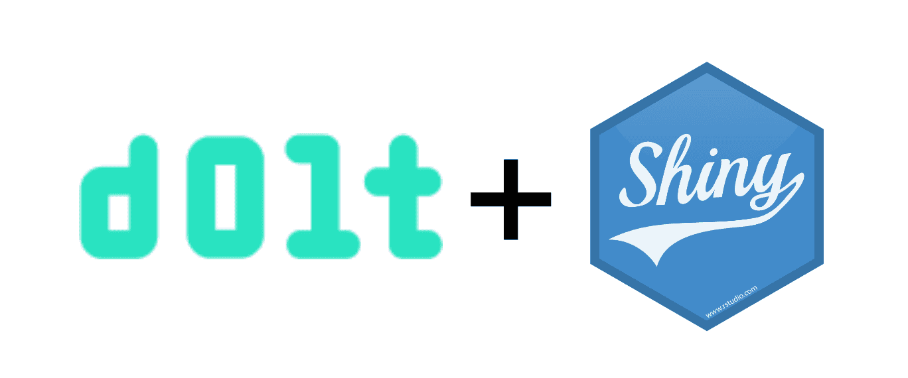

This is the weekly CEO update from [DoltHub](https://www.dolthub.com/). I'm Tim, the CEO of DoltHub. 

Some of you may have noticed we've gone up from three to five blog posts per week. No generative AI play here. They're all human written. We are just shouting at the internet until it listens.

### Dolt adds a cgo Dependency

We're working on [better compression for Dolt databases](https://www.dolthub.com/blog/2024-04-22-dolt-storage-dictionaries/). As part of that work we were debating using a pure Golang implementation of zStd compression or the native C version. After much debate and testing, we decided that using the C implementation was best. [Aaron](https://www.dolthub.com/team#aaron) wrote about the trade offs you should consider when [taking a C dependency in Golang](https://www.dolthub.com/blog/2024-05-01-cgo-tradeoffs/). This is part of our ongoing [Golang blog series](https://www.dolthub.com/blog/?q=golang).

### DoltLab: Getting started

[DoltLab](https://www.dolthub.com) is getting some love as we roll out more Enterprise features. DoltLab got its [own website](https://www.doltlab.com/) and [documentation](https://docs.doltlab.com/). As part of that, I installed DoltLab on an EC2 host using [the new installer](https://www.dolthub.com/blog/2024-04-11-doltlab-installer/) and wrote about it in a [Getting Started blog](https://www.dolthub.com/blog/2024-05-02-doltlab-getting-started/). You can have a DoltLab up and running on an EC2 instance in less than 30 minutes.

### Shiny Works With Dolt

We're on a mission to show that [Dolt just works](https://docs.dolthub.com/guides/dolt-tested-apps) with all your favorite tools in all your favorite languages. This week, [the spotlight](https://www.dolthub.com/blog/2024-04-26-dolt-r-shiny/) is on [MediaWiki](https://www.mediawiki.org/wiki/MediaWiki) and [Shiny](https://shiny.posit.co/), a user interface builder in R or Python.

A user showed up on our Discord asking for help building a UI for Dolt in R using Shiny so help we did, complete with sample code. If you want to see how your favorite tool or framework works with Dolt, just reply to this email and we'll get it on the schedule.

Until next week. As always, just reply to this email if you want to chat.

--Tim