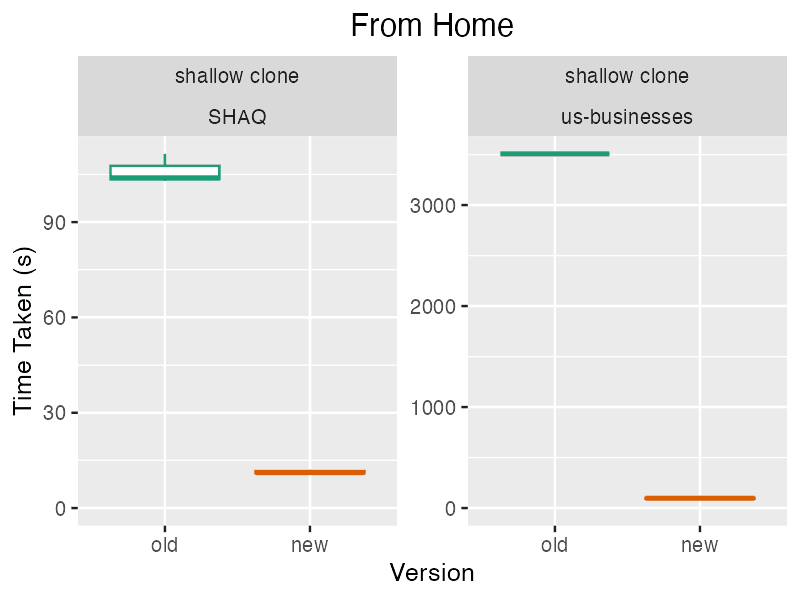

This is the weekly CEO update from [DoltHub](https://www.dolthub.com/). I'm Tim, the CEO of DoltHub. 

The theme of this email is speed. I wrote it as fast as I could to compete with Dolt. I still lost.

### Faster Pulls. Yes Please.

Now that Dolt's SQL is [fast](https://docs.dolthub.com/sql-reference/benchmarks/latency) and [correct](https://docs.dolthub.com/sql-reference/benchmarks/correctness), we have a lot more time available to work on making the Git-style version control features better. 

This week, we're pleased to announce [a new puller](https://www.dolthub.com/blog/2024-05-08-dolt-new-puller/), the code that syncs databases between a remote and your local copy. It's a lot faster especially for home networks. 

### Faster Index Builds. Also yes.

We recently had a customer report a very slow index build. Upon digging in, we realized Dolt made some pretty strong assumptions about the hard drive it was attached to being SSD. This led us to fix a pretty [gnarly bug on our tablscan path](https://www.dolthub.com/blog/2024-05-06-hdd-read-planning/). This made index builds ~100X faster for large tables on hard disks.

### Faster JSON Reads. You have to be kidding...

This one doesn't have a blog. We recently removed unnecessary deserialization from the JSON read path. This means JSON reads got about 20% faster on average. We know JSON is very popular for many Dolt use cases, including [video game configuration](https://www.dolthub.com/blog/2024-03-18-dolt-for-gamedev/), so we're going to be announcing more improvements here soon.

Until next week. As always, just reply to this email if you want to chat.

--Tim