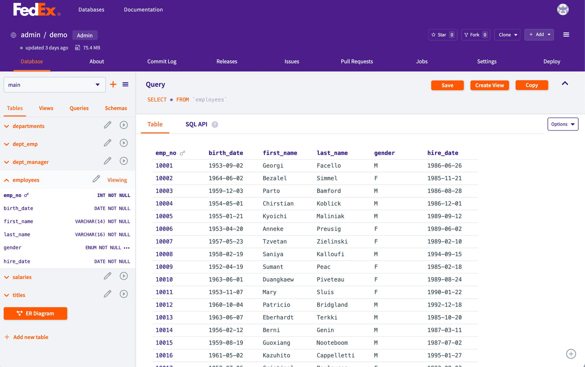

This is the weekly CEO update from [DoltHub](https://www.dolthub.com/). I'm Tim, the CEO of DoltHub. 

After Zach's [controversial blog about calling variables ok](https://www.dolthub.com/blog/2024-05-10-ok-considered-harmful/), a reader sent me the following joke which I enjoyed, "I thought the three hard problems were exactly-once message delivery, naming things, and exactly-once message delivery...". Keep the jokes coming. It's the hardest part of writing this email.

### Big Numbers

[Neil](https://www.dolthub.com/team#james) wrote [a meme-filled blog about big numbers](https://www.dolthub.com/blog/2024-05-28-160-bits/). It did [pretty well on Reddit](https://www.reddit.com/r/programming/comments/1d2nxvb/hash_collisions_how_large_is_a_160_bit_number/) because it's the type of post that does. Anyway, we care about this because each database "chunk" in Dolt is content-addressed with a 20 byte key, or, 160 bits. If two chunks hash to the same value, Dolt has problems. The conclusion of the blog is, this is exceedingly unlikely.

### Dolt == MySQL

As many of you know, we're on a mission to match MySQL SQL exactly in Dolt. This week, [James](https://www.dolthub.com/team#james) published his [monthly correctness update](https://www.dolthub.com/blog/2024-05-29-correctness-update/) where he focuses on a new suite opf correctness tests we found: [SQLAcidTests](https://github.com/sqlstandardsproject/sqlacidtest). These tests were really Postgres -centric but we made most of them work with Dolt.

Remember, if you find SQL that works with MySQL but not with Dolt, we'll [fix it in 24 hours](https://www.dolthub.com/blog/2024-05-24-more-24-hour/). 

### DoltLab: Your Self-hosted DoltHub

We're finding more and more Dolt users are interested in DoltLab as a remote for their Dolt instances. DoltLab is a version of DoltHub you can deploy on-premises. This week, [Dustin](https://www.dolthub.com/team#dustin) published a blog about how to get started with [DoltLab in Microsoft Azure](https://www.dolthub.com/blog/2024-05-30-getting-started-with-azure-and-doltlab/). [Taylor](https://www.dolthub.com/team#dustin) also wrote a blog about [how to customize your DoltLab Enterprise look and feel](https://www.dolthub.com/blog/2024-05-23-customizing-doltlab-colors/) which is worth it just for the demos.

Until next week. As always, just reply to this email if you want to chat.

--Tim