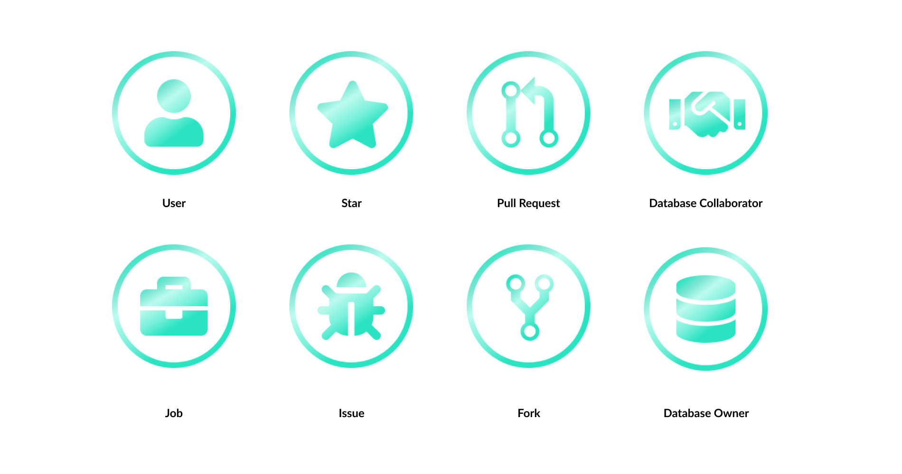

This is the weekly CEO update from [DoltHub](https://www.dolthub.com/). I'm Tim, the CEO of DoltHub. 

Things were looking dire for my Oilers when I sent last week's email but much to my surprise, they are still alive. Since it seemed to work last week, Go Oilers!

### Three-Way Merge

Dolt is the only SQL database that offers [three-way merge](https://www.dolthub.com/blog/2024-06-19-threeway-merge/) of schema and data. My [latest blog](https://www.dolthub.com/blog/2024-06-19-threeway-merge/) is a deep dive into three-way merge of files followed by a step-by-step guide on how Dolt three-way merges your databases. For a pretty complicated process, the results are mostly intuitive. 

Curl up and give [the blog](https://www.dolthub.com/blog/2024-06-19-threeway-merge/) a read. It's the culmination of many years of hard work making three-way merge in Dolt intuitively work at scale.

### DoltHub Badges

The DoltHub profile page [is getting some love](https://www.dolthub.com/blog/2024-06-20-start-earning-achievements-on-dolthub/). We started this company because we wanted a place on the internet to share open, maintained data. DoltHub is that place. While it's taking longer than we expected, `post-no-preference`'s US stock market databases demonstrate what we set out to do. We just need more scale!

In order to encourage you all to share and collaborate more on DoltHub, we've [released DoltHub badges](https://www.dolthub.com/blog/2024-06-20-start-earning-achievements-on-dolthub/). Your profile page will now be adorned with a set of achievements to give you a little extra nudge to participate in the DoltHub community. Start earning those badges.

### MySQL Replication Protocol

[Jason's](https://www.dolthub.com/team#jason) first big project at DoltHub was building `binlog` replication from MySQL to Dolt. His latest project is building the reverse, `binlog` replication from a Dolt branch to MySQL. Through both these projects he's become a MySQL `binlog` replication expert. In his latest blog, he explains in detail [how `binlog` replication works in MySQL](https://www.dolthub.com/blog/2024-06-17-mysql-replication/). It's a fun technical deep dive into a somewhat mysterious protocol.

Until next week. As always, just reply to this email if you want to chat.

--Tim