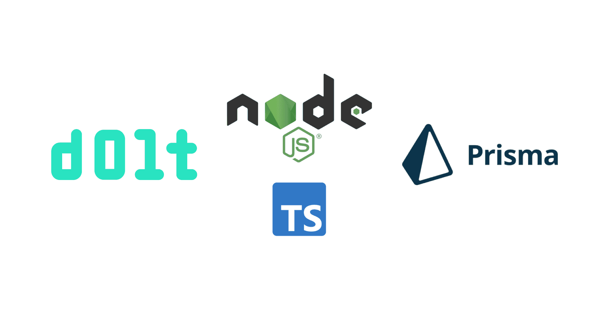

This is the weekly CEO update from [DoltHub](https://www.dolthub.com/). I'm Tim, the CEO of DoltHub. 

I'm back and refreshed from my anniversary trip. Still married so that's a win. Back to the business of building the world's first version controlled database.

### Replicate a Branch to MySQL

https://www.dolthub.com/blog/2024-07-05-binlog-source-preview/

### Prisma Works with Dolt

### Golang Generic Collection Types

https://www.dolthub.com/blog/2024-07-01-golang-generic-collections/

Until next week. As always, just reply to this email if you want to chat.

--Tim