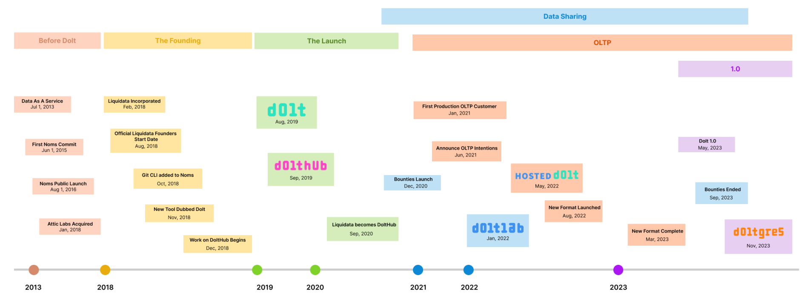

This is the weekly CEO update from [DoltHub](https://www.dolthub.com/). I'm Tim, the CEO of DoltHub. 

It's customary to start this email with a joke. We'll fix your bugs in [24 hours or less](https://www.dolthub.com/blog/2024-05-15-24-hour-bug-fixes/). No joke.

### Trust Dolt

Lately, I've been writing a lot about trusting Dolt in your stack. First, I wrote [a haters guide to Dolt](https://www.dolthub.com/blog/2024-07-03-why-no-dolt/), listing the most common reasons we hear people don't use Dolt and our most common rebuttals. I first noted the initial Noms commit in 2015 in this article. This week, I followed that up with [a timeline of Dolt's milestones](https://www.dolthub.com/blog/2024-07-25-dolt-timeline/) throughout the years. A production quality version controlled database is years in the making. All those accumulated years make trusting Dolt easier.

### Debezium Works with Dolt

We're on a mission to show that [Dolt just works](https://docs.dolthub.com/guides/dolt-tested-apps) with all your favorite tools in all your favorite languages. This week, [the spotlight](https://www.dolthub.com/blog/2024-07-19-debezium-works-with-dolt/) is on [Debezium](https://debezium.io/), a popular open source [change data capture](https://www.dolthub.com/blog/2023-03-01-change-data-capture/) tool. This was all made posssible by our [recent launch of Dolt to MySQL replication](https://www.dolthub.com/blog/2024-07-05-binlog-source-preview/).

### Best Static Analysis Tool for Golang

We have a new blog in our [Golang blog series](https://www.dolthub.com/blog/?q=golang). This time [Nick](https://www.dolthub.com/team#nick) wrote about [finding the best static analysis tool for Golang](https://www.dolthub.com/blog/2024-07-24-static-analysis/). Spoiler alert. It's [`golangci-lint`](https://github.com/golangci/golangci-lint).

Until next week. As always, just reply to this email if you want to chat.

--Tim