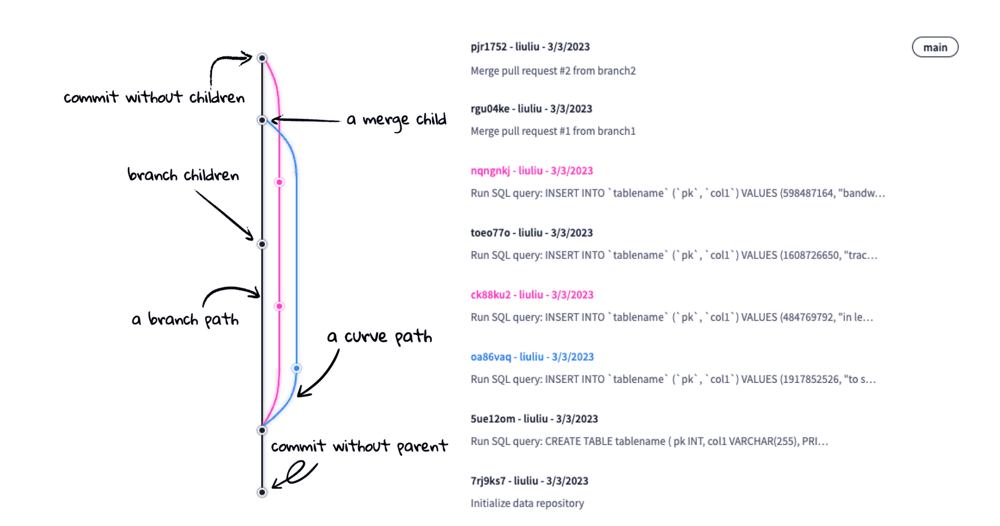

This is the weekly CEO update from [DoltHub](https://www.dolthub.com/). I'm Tim, the CEO of DoltHub. 

A couple dolts are making the trip to Vegas next week for Ai24, including me. If you are also going, come by our booth and say hi in person. I'll also be at the craps table losing money from time to time, if that's more your thing. 

### Drawing a Commit Graph

DoltHub's [commit graph implementation](https://www.dolthub.com/repositories/onefact/paylesshealth/commits/main/graph) looks really nice. [Liu Liu](https://www.dolthub.com/team#liuliu) was not satisfied with other open source web commit graph implementations so she built a better one and [open sourced](https://github.com/liuliu-dev/CommitGraph) it. She also wrote a [very good blog](https://www.dolthub.com/blog/2024-08-07-drawing-a-commit-graph/) about how it works. It will also work with Git commit graphs.

### Standard Dolt Deployments

Here at DoltHub, we build a lot of products. We often find that customers are somewhat confused with the plethora of options. I wrote [a blog with a lot of pictures](https://www.dolthub.com/blog/2024-08-02-dolt-deployments/) explaining how most customers deploy Dolt in production. We have MySQL-inspired deployments, Git-style deployments, and a mix of those two. If you're wondering how other people deploy Dolt, [this blog is a good reference](https://www.dolthub.com/blog/2024-08-02-dolt-deployments/).

### `python-mysql-replication` Works With Dolt

https://www.dolthub.com/blog/2024-08-08-python-mysql-replication-works-with-dolt/

Until next week. As always, just reply to this email if you want to chat.

--Tim