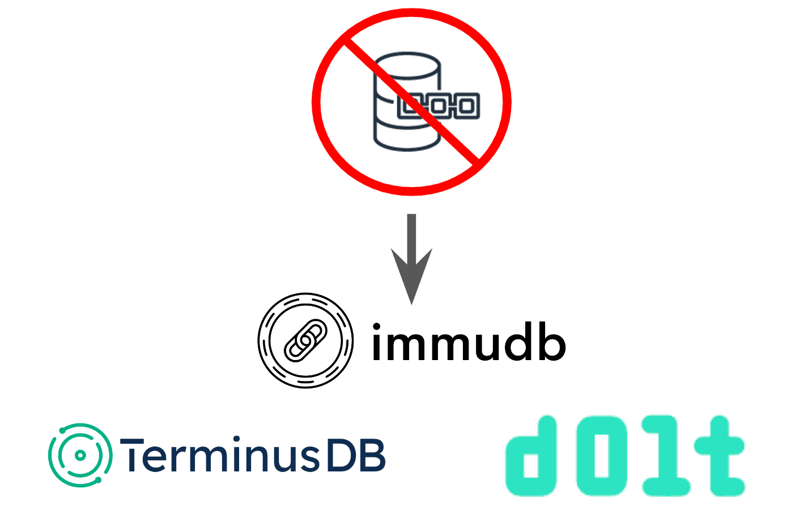

This is the weekly CEO update from [DoltHub](https://www.dolthub.com/). I'm Tim, the CEO of DoltHub. 

It was a tiring week at AI4. I'm not used to having to act chipper and talk to strangers for six hours a day. But it was good. It's time to start spreading the word about Dolt face-to-face. We got a couple, "This is the coolest company here". 

### Hosted MySQL with a Dolt Replica

Are you a little worried about running Dolt as your primary? Are you looking for a better MySQL Hosting solution? Do you want an immutable, queryable audit log of every MySQL transaction? Is compliance asking for one of those?

[Hosted Dolt now supports a MySQL primary](https://www.dolthub.com/blog/2024-08-09-hosted-mysql-dolt-replica-announcement/) with a Dolt replica. This comes with all the great features of Hosted Dolt: backups, logging, failover, and the built-in workbench. Your Dolt replica is an extra security blanket against a bad query or an audit log of changes you can use to say, placate compliance. Plus, you get Dolt's engineer-led customer support. If your tired of AWS RDS and want an alternative, try it out.

### AWS QLDB Deprecated. Dolt is the Best Alternative.

AWS deprecated QLDB. If you're using QLDB or are QLDB curious, there are other open source immutable database alternatives. I make [some recommendations](https://www.dolthub.com/blog/2024-08-12-qldb-deprecated-alternatives/), leaning heavily on my [So You Want an Immutable Database? blog](https://www.dolthub.com/blog/2024-08-12-qldb-deprecated-alternatives/) from a few years back.

### `dolt log --graph` Released

We have a commit graph specialist in the house. Last week, [Liu Liu](https://www.dolthub..com/team#liuliu) wrote about [her open source React Commit Graph library](https://www.dolthub.com/blog/2024-08-07-drawing-a-commit-graph/). This week, [she announces that Dolt now supports a command line version, `dolt log --graph`](https://www.dolthub.com/blog/2024-08-14-announcing-dolt-log-graph/). She also compares her commit graph implementation to Git's. Dolt's commit graphs are obviously better. Dolts > Gits.

Until next week. As always, just reply to this email if you want to chat.

--Tim