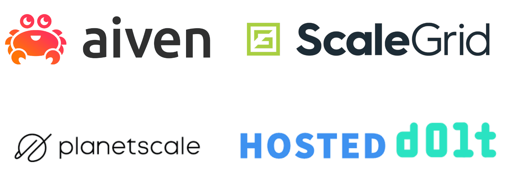

This is the weekly CEO update from [DoltHub](https://www.dolthub.com/). I'm Tim, the CEO of DoltHub. 

We're looking for [additional conferences to attend](https://www.dolthub.com/blog/2024-08-20-on-the-road/). If you are a regular attendee at a conference where you think a DoltHub booth would fit, please respond to this email.

### Hosted Dolt Private Deployments

This week, we launched [Hosted Dolt Private Deployments](https://www.dolthub.com/blog/2024-08-21-hosted-private-deployments/). Hosted Dolt can now deploy onto a host only accessible via your AWS VPC. Before, your Hosted Dolt endpoint was exposed to the public internet. Security minded folks will prefer a private Hosted Dolt deployment. Private deployments are managed and priced the same. The downside is it takes about 20 minutes to deploy as opposed to under 5 minutes and requires some additional VPC configuration on your end. 

[Aaron's launch blog](https://www.dolthub.com/blog/2024-08-21-hosted-private-deployments/) has instructions on how to set one up. If you've been waiting for Hosted Dolt to support private deployments, now is the time to try it.

### What's the Best Hosted MySQL?

Last week I [announced we got into the MySQL Hosting business](https://www.dolthub.com/blog/2024-08-09-hosted-mysql-dolt-replica-announcement/). Hosted Dolt is the only MySQL hosting solution that gives you the full audit and disaster recovery capabilities of a Dolt replica. What are your other MySQL hosting options and how do they compare to Hosted Dolt? I [wrote about that](https://www.dolthub.com/blog/2024-08-19-hosted-mysql/) this week. Curiously, Oracle, the owners of MySQL do not offer a vanilla hosted MySQL in Oracle Cloud.

### Git Workspaces

Have you ever wondered why Git has a staging area? Why do you have to `add` then `commit`? In Git, this concept is called a workspace. [Neil](https://www.dolthub.com/team#neil), our resident Git expert, [explains what Git workspaces are, how they work, and why the exist](https://www.dolthub.com/blog/2024-08-16-workspace-review/). He then explains how Dolt differs and teases his work to add support for `dolt add --patch`.

Until next week. As always, just reply to this email if you want to chat.

--Tim