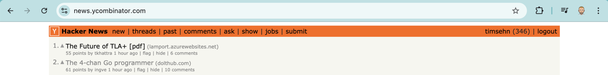
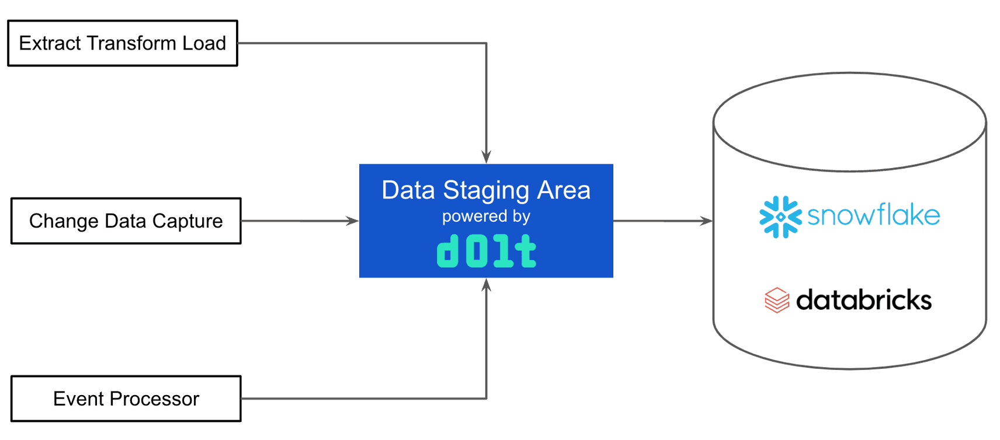

This is the weekly CEO update from [DoltHub](https://www.dolthub.com/). I'm Tim, the CEO of DoltHub. 

It's time to break out the HackerNews meme! 

Well, not quite, but Zach's irreverent [4-chan Go Programmer article](https://www.dolthub.com/blog/2024-08-23-the-4-chan-go-programmer/) got to #2.

### Dolt for Data Engineers

Inspired by some of my conversations at Ai4 with folks on the analytics side of the data stack, I went back to one of our greatest hits, [my data quality control article](https://www.dolthub.com/blog/2022-11-23-data-quality-control/), and [got into some specifics](https://www.dolthub.com/blog/2024-08-28-dolt-for-data-engineers/) about how Dolt can be used on the analytics side of the house. I suggest Dolt can be used as a [Data Staging Area](https://www.dolthub.com/blog/2024-08-28-dolt-for-data-engineers/#the-data-staging-area) or to [version Control your Gold Tables](https://www.dolthub.com/blog/2024-08-28-dolt-for-data-engineers/#version-controlled-gold-tables). 

These are cool use cases. If you're a data engineer and are Dolt curious, let's work together to implement one or both of these ideas. Just respond to this email.

### Doltgres Indexes

https://www.dolthub.com/blog/2024-08-27-enhancing-index-support/

### Workspace Updates

https://www.dolthub.com/blog/2024-08-29-workspace-updates/

Until next week. As always, just reply to this email if you want to chat.

--Tim