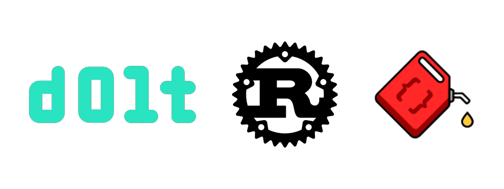

This is the weekly CEO update from [DoltHub](https://www.dolthub.com/). I'm Tim, the CEO of DoltHub. 

Members of the Rust community, affectionately called Rustaceans, come by our Discord occasionally to tell us that Dolt should be written in Rust. It's a straight up Rustacean on Gopher crime. Later in this email, I present Rustaceans an olive branch.

### Dolt Rebase Conflict Resolution

In January, we [release interactive rebase](https://www.dolthub.com/blog/2024-01-03-announcing-dolt-rebase/) even though we're kind of [scared of it](https://www.dolthub.com/blog/2022-12-14-wordcels-guide-to-git/#what-about-git-rebase). This week, we announced you can [now resolve conflicts when rebasing](https://www.dolthub.com/blog/2024-09-05-rebase-conflict-resolution/), a missing feature since launch. 

This was a customer requested feature. We build features if you ask! Reply to this email, [make an issue](https://github.com/dolthub/dolt/issues), or come by [our Discord](https://discord.gg/gqr7K4VNKe) if you want us to build something for your use case.

### Dolt can count faster than MySQL

As regular readers of this email know, we're constantly working on performance. We started with `sysbench` and [got that test suite down to 1.3X MySQL](https://docs.dolthub.com/sql-reference/benchmarks/latency), with write tests averaging faster than MySQL. We moved on to TPC-C and are sitting at [2.5X MySQL](https://docs.dolthub.com/sql-reference/benchmarks/latency), with the goal being 2X by end of year. Dolt is so fast, most people don't notice a performance difference between Dolt and MySQL.

As part of this performance work, we found a set of queries where Dolt is 3X faster than MySQL, [counting things](https://www.dolthub.com/blog/2024-09-04-faster-than-mysql/)! [Max](https://www.dolthub.com/team#max) dives into [why Dolt is faster than MySQL](https://www.dolthub.com/blog/2024-09-04-faster-than-mysql/) for this use case.

### Dolt works with Diesel

Alright Rustaceans, your time has come. [Dolt works with Diesel](https://www.dolthub.com/blog/2024-08-30-dolt-diesel-getting-started/), a Rust ORM. Technically Dolt has worked with Rust and Diesel for a while but [this blog](https://www.dolthub.com/blog/2024-08-30-dolt-diesel-getting-started/) and [sample code](https://github.com/dolthub/dolt-diesel-getting-started) prove it.  

Also, [Doltgres works with TablePlus](https://www.dolthub.com/blog/2024-09-03-tableplus-works-with-doltgres/). Doltgres is a bit of a ways off ORM support so we're taking workbench wins. [Doltgres goes Beta in Q1 2025](https://www.dolthub.com/blog/2024-08-06-doltgres-beta/).

Until next week. As always, just reply to this email if you want to chat.

--Tim