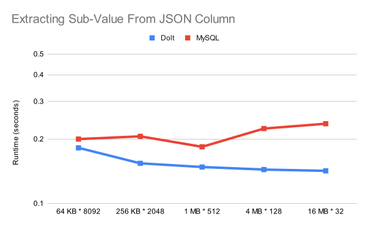

This is the weekly CEO update from [DoltHub](https://www.dolthub.com/). I'm Tim, the CEO of DoltHub. 

My son asked me what I did at work at dinner last night. I said I wrote a blog article (coming next Wednesday). He asked, "What was the joke?". Good memory! I said, "No, that's the email. Do you have any good jokes?" He replied, "What is the snake's favorite subject? Hisssstory." He's 10.

### Dolt vs MySQL: JSON

We think Dolt is the best SQL database for JSON objects. We're here to prove it. This week, we [built a JSON benchmarking suite and compared Dolt to MySQL](https://www.dolthub.com/blog/2024-09-09-json-mysql-vs-dolt/). The [article](https://www.dolthub.com/blog/2024-09-09-json-mysql-vs-dolt/) is filled with helpful charts like the one below that show performance at various JSON object sizes. Dolt is the clear winner especially for large objects. Plus, you get the full power of Dolt version control.

### `dolt add --patch`

On the heels of our recent [release of the `dolt_workspace` tables](https://www.dolthub.com/blog/2024-08-29-workspace-updates/), we [released our clone of the `git add --patch` workflow, `dolt add --patch`](https://www.dolthub.com/blog/2024-09-10-dolt-add--patch/). This feature allows you to selectively stage certain rows from your working set. 

This was a [feature request from December 2021](https://github.com/dolthub/dolt/issues/2465). We eventually get to your issue! Honestly, our SQL engine is getting good enough now that we have time to work on more of the Git-ty features. If you have a Git feature you need, just ask.

### Building an Electron App

One of our little known open source products is the [Dolt Workbench](https://github.com/dolthub/dolt-workbench). Throw it a star if you get a chance. It's a modern Postgres and MySQL compatible workbench powered by NextJS. It has a very similar user interface to DoltHub. If you use it to attach to Dolt, you unlock all the version control features. 

The Dolt Workbench is cool, but the deployment story wasn't great. You had to run it via a Docker container and access it through your browser. This made it kind of tricky to connect to local databases because of Docker networking. A downloadable version you could run like any other program on your system would be more ergonomic. 

We heard the solution to this problem is [Electron](https://www.electronjs.org/). We've been hacking away at the workbench for a few weeks now trying to get it to work with Electron. We've learned a ton and we [wrote it down](https://www.dolthub.com/blog/2024-09-11-building-an-electron-app-with-nextjs/) to make it easier for the next Electron user. 

Until next week. As always, just reply to this email if you want to chat.

--Tim