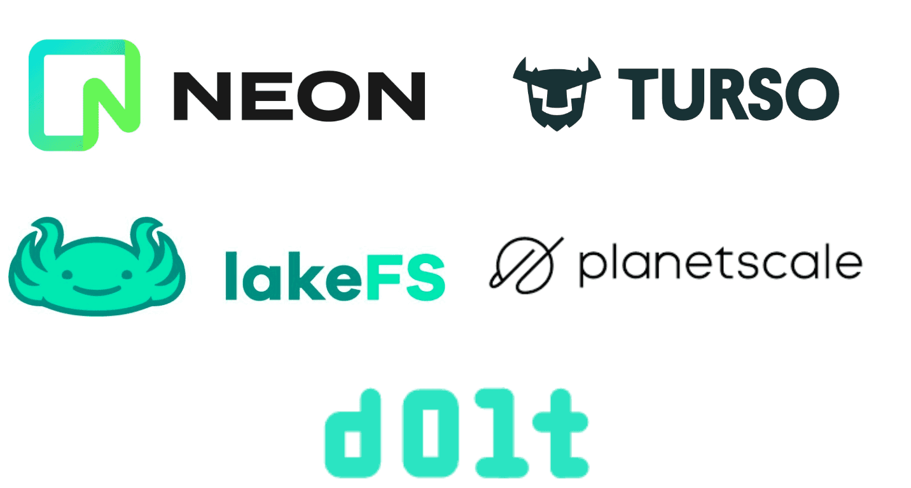

This is the weekly CEO update from [DoltHub](https://www.dolthub.com/). I'm Tim, the CEO of DoltHub. 

{Joke}

### Database Branches 

A few databases are claiming to support branches. We think Dolt is the only database with true branch support. I wrote [an article surveying the database branch space](https://www.dolthub.com/blog/2024-09-18-database-branches/) and explain what other databases mean when they say branches.

### Signed Commits

The latest release of Dolt allows you to [sign commits](https://www.dolthub.com/blog/2024-09-16-signed-commits/) just like you would in Git. This extra layer of verification can be very useful in audit use cases where you want to be sure the person or system editing your database is who they say they are. Or, at least has the right key. Signed commits can be used to augment standard users and grants or as a decentralized authentication system.

### log4j for Golang

The latest in [our Golang blog series](https://www.dolthub.com/blog/?q=golang) is [Zach](https://www.dolthub.com/team#zach) yearning for his lost love: log4j. [Nothing in Golang compares](https://www.dolthub.com/blog/2024-09-13-package-scoped-logging-in-go-log4j/). Zach takes a shot at configuring a couple of the standard Golang loggers, Zap and logrus, to be log4j-like. He built a couple prototypes and would like your feedback.

Until next week. As always, just reply to this email if you want to chat.

--Tim