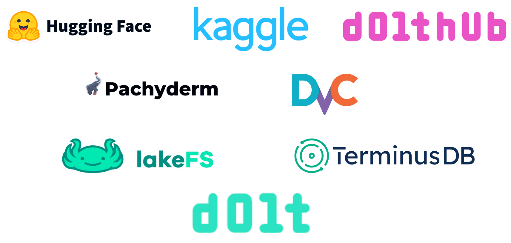

This is the weekly CEO update from [DoltHub](https://www.dolthub.com/). I'm Tim, the CEO of DoltHub. 

I received so many joke suggestions after last week's email. It was quite inspiring to know that so many people read this update not for the Dolt content, but for my silly joke. Here was the recommendation I liked the most, inspired by a reader's child:

Knock, knock.  
Who's there?  
Olive the branch.
Olive the branch who?  
Olive the branch and other Git features in Dolt.  

This is especially topical because [Dolt is the only SQL database with true branches](https://www.dolthub.com/blog/2024-09-18-database-branches/). That's a big olive branch, so to speak.

### Git For Data 2024

One of our first successful blog articles was [So you want Git for Data?](https://www.dolthub.com/blog/2020-03-06-so-you-want-git-for-data/) It was so successful that it spawned a series of ["So you want..."](https://www.dolthub.com/blog/?q=%22so%20you%20want%22) articles. The Git for Data blog is over four and a half years old and it was in desperate need of an update: [So you want Git For Data? 2024 Edition](https://www.dolthub.com/blog/2024-09-24-git-for-data/).

This won't shock any of you but we think Dolt is the one true Git for data. 

### JSON Showdown: Dolt vs Postgres

[Prolly trees](https://docs.dolthub.com/architecture/storage-engine/prolly-tree) are great for storing JSON. We've been writing blog articles to convince you. First, we designed a JSON benchmark and [compared Dolt to MySQL using that benchmark](https://www.dolthub.com/blog/2024-09-09-json-mysql-vs-dolt/). Dolt surpassed MySQL rather handily so we decided to take on a heftier challenge: Postgres, the undisputed champion of open source SQL databases. [Dolt compares favorably to Postgres](https://www.dolthub.com/blog/2024-09-22-json-postgres-vs-dolt/) as well especially for large JSON objects. If you have a database use case with a lot of JSON, consider choosing Dolt.

### Flutter Works With Dolt

We're on a mission to show that [Dolt just works](https://docs.dolthub.com/guides/dolt-tested-apps) with all your favorite tools in all your favorite languages. This week, [the spotlight](https://www.dolthub.com/blog/2024-09-20-flutter-and-dolt/) is on [Flutter](https://flutter.dev/), a Google-sponsored, open source framework powered by [Dart](https://dart.dev/) for building beautiful, natively compiled, multi-platform applications from a single codebase. The article come complete with [sample code](https://github.com/dolthub/dolt-flutter-example), if you're in the mood to have Dolt back an iPhone app.

Until next week. As always, just reply to this email if you want to chat.

--Tim