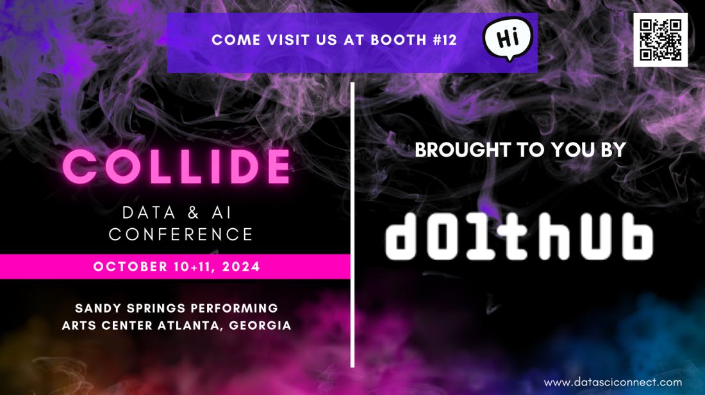

This is the weekly CEO update from [DoltHub](https://www.dolthub.com/). I'm Tim, the CEO of DoltHub. 

[Brian](https://www.dolthub.com/team#brian) and I are back on the road next week. We're in Atlanta for the Collide Data & AI Conference. If you're in the area and you want to put a name to these hilarious jokes, reply to this email. Or, if you're attending the conference, stop by our booth. Look at this fancy marketing copy they gave us. How can you say no to this?

### Dolt Undrop in the Wild

Last week, we had a customer saved by [Dolt's unique undrop functionality](https://dolthub.com/blog/2024-10-01-dolt_undrop-in-the-wild/). The joy was palpable when we told them recovery from an erroneous `drop database` is no big deal when you're using Dolt.

Anyone who has been running databases for a while has a `drop database` horror story. 

"I thought I was running it on dev."   
"The new hire was just trying to get his personal deployment going."   
"I was in a hurry to help a customer and used the wrong terminal."   

Dolt is the best database on earth to recover from operator error because the history of the database is stored online. Dolt's undrop functionality pairs well with traditional Git-style rollbacks like reset and revert. Don't wait until you drop your production database. Add a  Dolt or Doltgres replica today to protect yourself. Be a hero.

### Open Data on DoltHub

The [US stock market data](https://www.dolthub.com/users/post-no-preference/repositories) maintained by `post-no-preference` is getting quite popular. He's a bit of a legend here at DoltHub as a champion of open data. We wrote about [his use case](https://www.dolthub.com/blog/2024-09-27-dolt-post-no-preference/) this week, hoping to inspire others to publish open databases for their communities. 

### Running a Network Isolated DoltLab 

DoltLab is a self-hosted DoltHub you can use an an internal data sharing platform in your organization. You get a handy web-based SQL workbench, issues, and pull requests on your Dolt databases. DoltLab is free and their is an Enterprise version if you need it.

A customer had a "no outbound network traffic" requirement for DoltLab. We made some changes to the system to remove unneeded external network calls and published [a blog article on how to remove the rest if you need to](https://www.dolthub.com/blog/2024-10-03-how-to-run-doltlab-without-egress/). If you need a DoltLab behind your firewall, you can do it.

Until next week. As always, just reply to this email if you want to chat.

--Tim