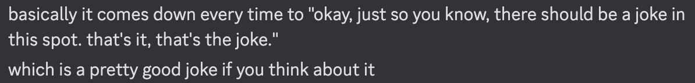

This is the weekly CEO update from [DoltHub](https://www.dolthub.com/). I'm Tim, the CEO of DoltHub. 

I bet you were expecting a Halloween joke. Nope. I was desperate so I [used that one two weeks ago](https://github.com/dolthub/weekly-updates/blob/main/emails/2024-10-18.md). I'm drafting a Dolt (user) to help me. From user Joop on [our Discord](https://discord.gg/gqr7K4VNKe).

### The Texas AI Massacre

[Brian](https://www.dolthub.com/team#brian) and I are back on the road next week. We're in Austin for the [MLOps and Generative AI World Conference](https://mlopsworld.com/). If you're in the area and you want to put a name to these hilarious jokes, reply to this email. Or, if you're attending the conference, stop by our booth. Check out this truly terrifying image they gave us.

### Dolt is Scary on the Inside

I will use Halloween to highlight one of my favorite horror adjacent featured images. Featured images are the images that show up on social sites when you post a link. [Liu Liu](https://www.dolthub.com/team#liuliu) helped me with this one. 

I used it because I wrote about all the files Dolt makes in the `.dolt` directory when you create a database: [Dolt's Anatomy](https://www.dolthub.com/blog/2024-10-28-dolt-anatomy/). This will help you understand some of the complexity going on under the hood in the world's first version controlled SQL database.

### Debugging a Tricky-or-Treaty DoltHub Issue 

[Dustin](https://www.dolthub.com) a recent [tricky DoltHub issue](https://www.dolthub.com/blog/2024-10-31-sleuthing-resource-leaks-in-dolt/) triggered by Dolt CPU and memory exhaustion. He dives into how Dolt, Golang, and the operating system interact locally and on DoltHub. If you're an aspiring Site Reliability Engineer (SRE), this is [an article](https://www.dolthub.com/blog/2024-10-31-sleuthing-resource-leaks-in-dolt/) for you.

### Nothingness and Nil Channel Values in Golang

What's scarier than the void? [Aaron](https://www.dolthub.com/team#aaron) doesn't blog often but when he does, it's usually worth it. This week, he published the latest in our [Golang series](https://www.dolthub.com/blog/?q=golang). He wrote about [Nil Channel Values](https://www.dolthub.com/blog/2024-10-25-go-nil-channels-pattern/). My favorite part was how when he started in Golang he thought the pattern was dumb and only realized how useful it was later. Read [his article](https://www.dolthub.com/blog/2024-10-25-go-nil-channels-pattern/) so you can skip the "thinking it's dumb" step.

Until next week. As always, just reply to this email if you want to chat.

--Tim
