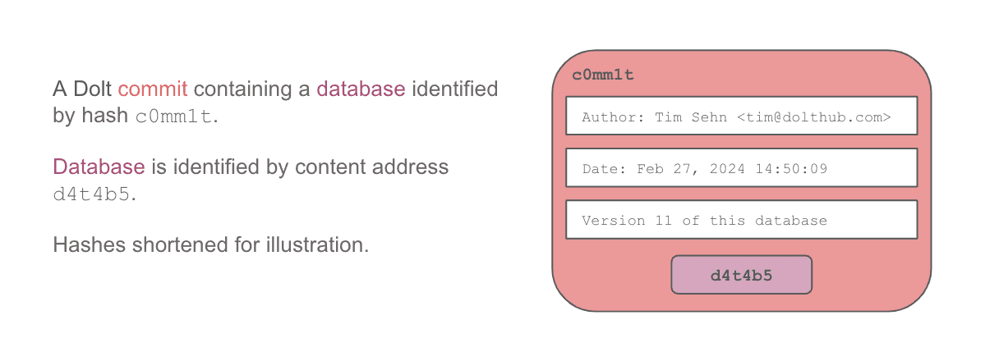

This is the weekly CEO update from [DoltHub](https://www.dolthub.com/). I'm Tim, the CEO of DoltHub. 

We're considering a MongoDB-compatible version of Dolt and all the names I suggest keep getting the "maybe you should workshop that one a bit more?". We called our database Dolt, like a stupid person. Is DongoDB really worse? If you have a name suggestion, let me know.

### DoltHub Continuous Integration

This week, I'm excited to announce a feature [Dustin](https://www.dolthub.com/team#dustin) has been building for a while: [Continuous Integration testing with Dolt and DoltHub](https://www.dolthub.com/blog/2024-11-14-continuous-integration-on-data/). The feature is new and not fully fleshed out yet, but I think anyone who reads this email will be able to see the promise. 

The main problem with testing in data workflows is that databases are write once. You can run tests on the new data but what do you do if the tests fail? Restore from a backup? Dolt fundamentally solves this problem with branch and merge, just like Git. So, make your writes on a branch, test it, put the changes through human review, and merge it if everything looks good. If the tests fail, delete the branch. No harm. No foul. This workflow allows for multiple concurrent writes making testing more isolated to only your data changes. We think this is just how data imports should work.

As you can see, I'm really excited about [Continuous Integration Testing of data](https://www.dolthub.com/blog/2024-11-14-continuous-integration-on-data/). Please try it out and let us know the features you want to see. Just reply to this email if you have any ideas.

### Dolt Hashes

The hashes in Dolt are content addresses. Dolt is the only content-addressed SQL database. How does it work? How can you make use of the content addresses? What can you use them for besides version control? My [latest article](https://www.dolthub.com/blog/2024-11-11-dolt-hashes/) answers all these questions.

### `fmt.Sprintf` is Slow

This week, [Max](https://www.dolthub.com/team#max) published [the latest](https://www.dolthub.com/blog/2024-11-08-sprintf-vs-concat/) in our [Golang series](https://www.dolthub.com/blog/?q=golang). Max was able to get single digit percentage latency improvements on some of our [sysbench tests](https://docs.dolthub.com/sql-reference/benchmarks/latency) by using string concatenation (ie `+`) rather than `sprintf`. [His article explains why](https://www.dolthub.com/blog/2024-11-08-sprintf-vs-concat/). 

Until next week. As always, just reply to this email if you want to chat.

--Tim