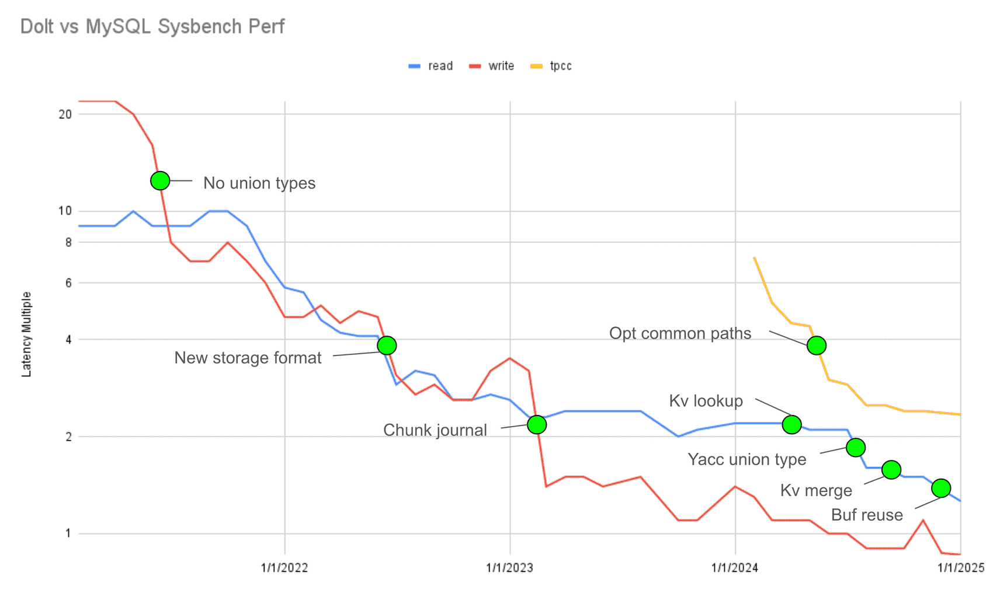

This is the weekly CEO update from [DoltHub](https://www.dolthub.com/). I'm Tim, the CEO of DoltHub. 

As some of you know, half of our company is based in Santa Monica (ie. West Los Angeles), including me. It's been a rough week for West LA and I'm writing this from a hotel room because I've been evacuated from my home. No joke.

That said, it's been a while since my last email so I would hate to leave you hanging another week.

### Dolt Workbench Remotes

Over the break, we've been hard at work making remotes a first class citizen in the [Dolt Workbench](https://github.com/dolthub/dolt-workbench). We first [launched support for remotes](https://www.dolthub.com/blog/2024-12-17-announcing-the-dolt-workbench-remotes-tab/) on December 17 and this week we [launched a more advanced fetch and sync interface](https://www.dolthub.com/blog/2025-01-07-fetching-and-syncing-remotes-using-the-dolt-workbench/). 

The [Dolt Workbench](https://github.com/dolthub/dolt-workbench) as a desktop app is one of [my favorite things](https://www.dolthub.com/blog/2024-12-30-dolt-wrapped/) we shipped in 2025. It works with regular MySQL and Postgres but [really shines when you attach it to Dolt](https://www.dolthub.com/blog/2024-12-02-workbench-better-with-version-control/). 

Next up for the workbench is a more compelling diff interface. As you can see, I'm a little excited about this...

### 10% Slower than MySQL

Over the break, we quietly announced we're only 10% slower than MySQL on a standard suite of `sysbench` tests. [This blog](https://www.dolthub.com/blog/2024-12-23-2024-perf-summary/) contains an update of one of my favorite graphs, Dolt compared to MySQL performance over time.

We started at 1500% slower than MySQL and now we're less than 15%. If you're waiting for Dolt to be performant, it is performant now. Now is the time to pick it up for your use cases.

### Golang!

We published a couple [Golang blogs](https://www.dolthub.com/blog/?q=golang) over the break that I want to draw attention to. The first is on [the new maps and slices packages in 1.23](https://www.dolthub.com/blog/2024-12-20-collection-functions-in-go-1-23/) and the second is on [the DebugString pseudo standard](https://www.dolthub.com/blog/2025-01-03-gos-debug-string-pseudo-standard/). Enjoy Gophers.

Until next week. As always, just reply to this email if you want to chat.

--Tim