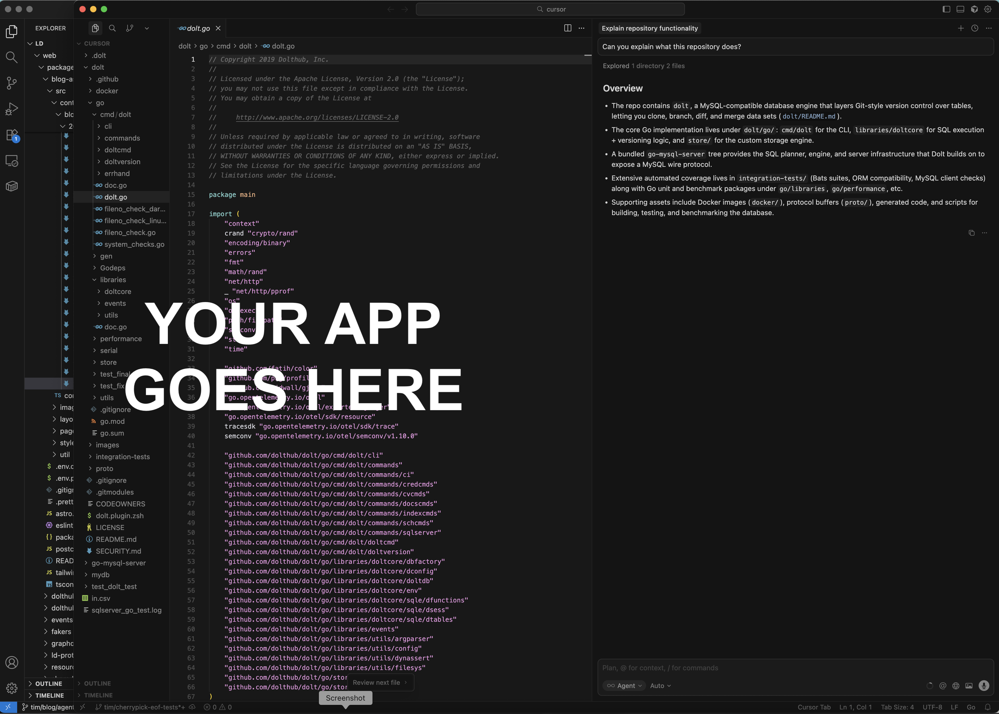

This is the weekly CEO update from [DoltHub](https://www.dolthub.com/). I'm Tim, the CEO of DoltHub. 

Next week is Thanksgiving here in the US of A. You will not get an email next week. Give thanks for not having to suffer through one of my horrible jokes.

### Cursor For Everything

Dolt allows you to build [Cursor of Everything](https://www.dolthub.com/blog/2025-11-19-cursor-for-everything/). Cursor just [raised at a big number](https://techcrunch.com/2025/11/13/coding-assistant-cursor-raises-2-3b-5-months-after-its-previous-round/). The chat on the side UI is both good and here to stay. Dolt lets you build chat on the side for your app. 

I'm so excited about this that I'm breaking my no image policy for this gem.

### Mutual TLS Auth

We're getting pretty deep into the MySQL feature stack. A user requested Mutual TLS Authentication and [Jason](https://www.dolthub.com/team#jason) [delivered](https://www.dolthub.com/blog/2025-11-20-client-cert-auth/). Now, you can use certificates to make sure all your Dolt clients are of pure intent and spirit. 

### JSON Merges

Did you know that Dolt has [really fast JSON](https://www.dolthub.com/blog/2024-09-09-json-mysql-vs-dolt/) support and [merges individual JSON objects](https://www.dolthub.com/blog/2025-11-17-understanding-json-merging/). I even forgot we merged JSON and it's my job to know! We think we're the best database for JSON. If you have a JSON use case, consider Dolt. We have an even cooler feature coming in the next couple weeks. Stay tuned.

As always, just reply to this email if you want to chat.

--Tim